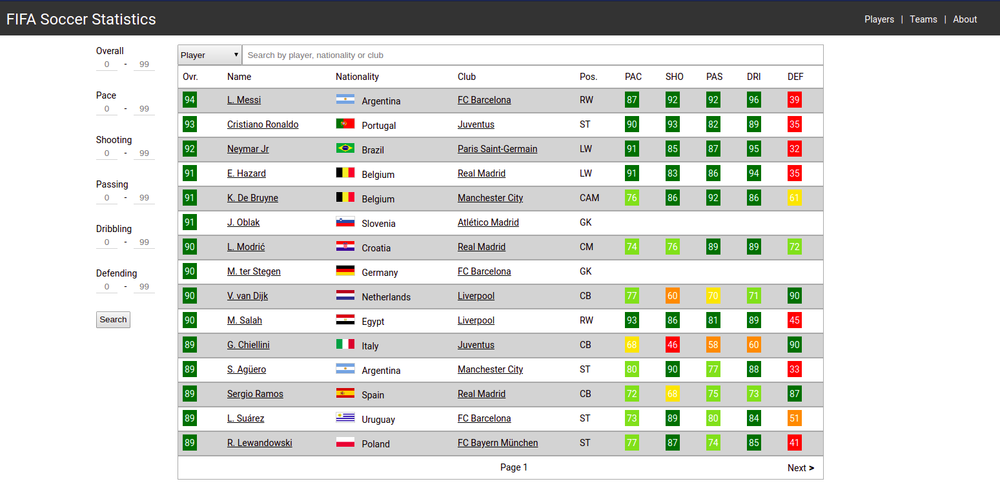
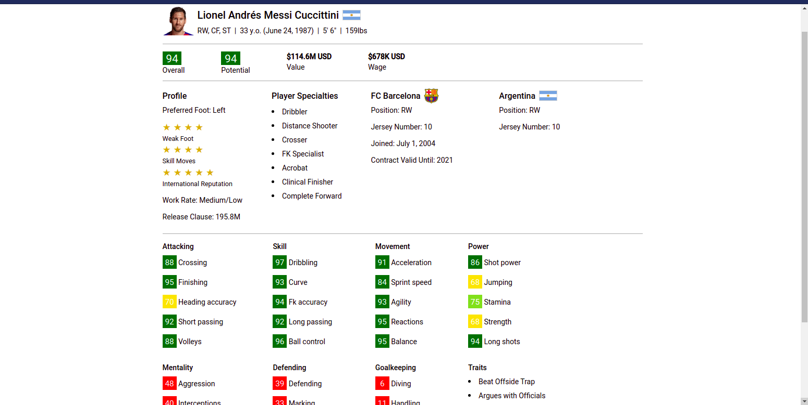
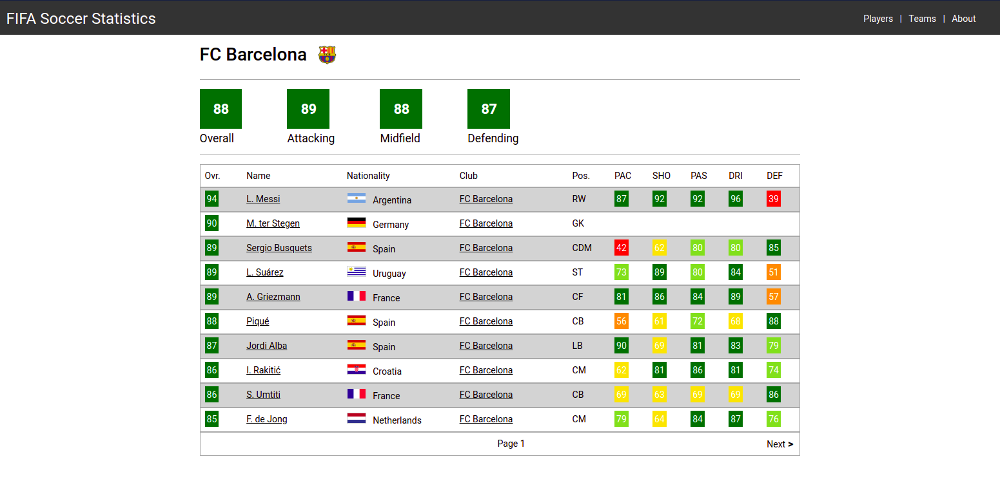

# fifastats







https://statsfifa.herokuapp.com/

Note: It may take a few seconds for the page to load because I'm using Heroku's free tier.

A web site that displays FIFA 20 player and team information.

Players and teams can be searched, sorted and filtered, as well as have each of their in-depth information viewed.

Stack: Angular, TypeScript, Node.js and PostgreSQL.

#### To run locally:

#### Front-end
Must have the Angular CLI installed. If not, run ```$ npm install -g @angular/cli```

 ```$ ng serve```

The ```host``` variable in the services must be set to the host of the Node.js server.

 #### Back-end
 ```$ cd backend```

 ```$ npm i```

 ```$ npm start```

The ```connectionString``` variable in ```backend/index.js``` must be set to the database URL of the PostgreSQL database that stores the player and team data.

Table schema and necessary SQL scripts are in ```backend/sql_scripts/```

Not included are the Node.js scripts used to write player and team data from ```backend/players_20.csv``` to the PostgreSQL database tables, but test data can be added through manual SQL statement.s

These scripts are not included in the repo, however test data can be added through manual SQL statements.
